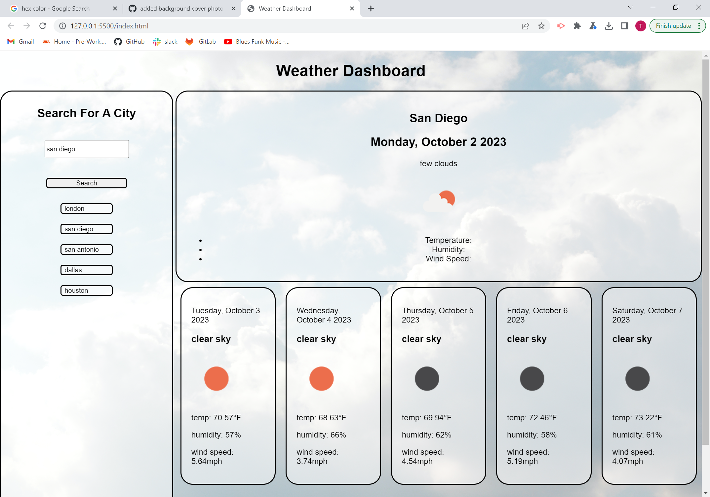

# weather-dashboard
https://tatumsterling.github.io/weather-dashboard/

## Description 
This application is a Weather Dashboard. It was created using javascipt, HTML, and CSS while pulling data from an OpenWeather API linked below 
https://openweathermap.org/api
The dashboard will take the user city search, convert city name to latitude and longitude coordinates to then use in the api call. This will return weather for the current day, and the next 5 days with information including: 
  - temperature
  - wind speed
  - humidity
  - description
  - icon
  - date

## Installation 
N/A

## Usage
To deploy this webpage click on the link in the top of the README file. From there it will take you to the front page of the weather application, where you will see a search bar. Type in the city you would like to retrieve the forcast for and it will populate the rest of the screen with the result. For easy access to recent searches, there is a search history element added to the page. If you want to view a previous city search, simply click on that city in the seach history area. below is a screenshot of the application.

## Credit
https://openweathermap.org/api ~ for the weather API 

## License
please refer to LICENSE in the repo

